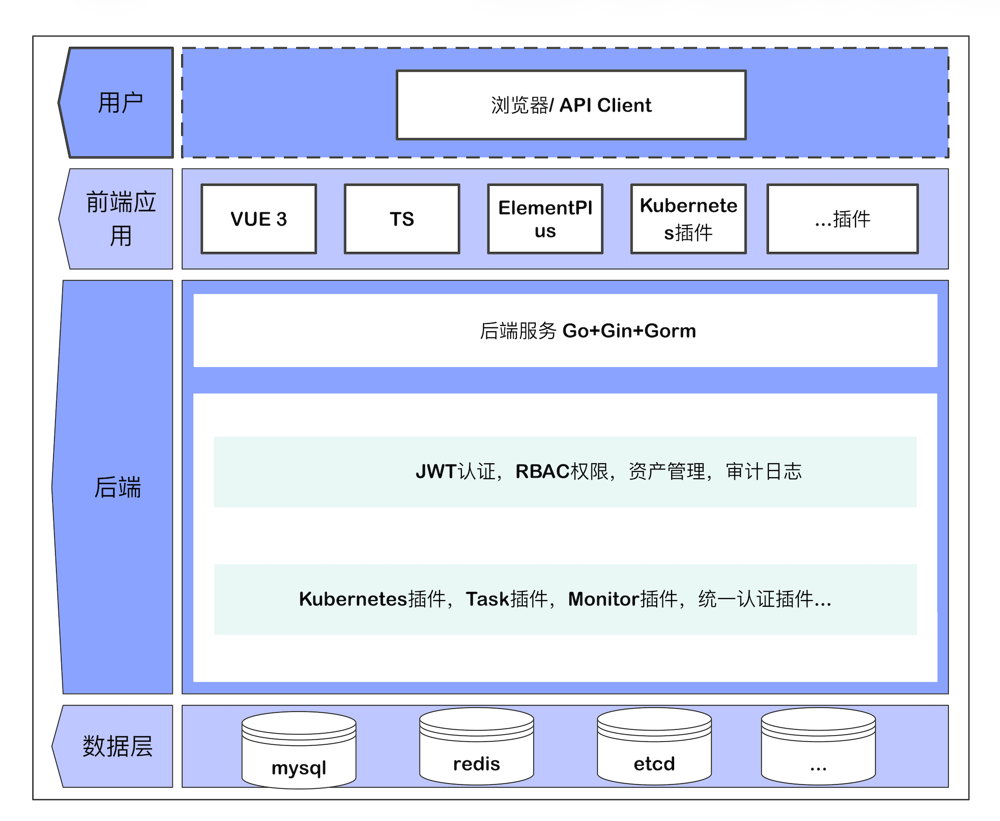

<p align="center">
  
</p>

<h3 align="center">OpsHub —— 现代化、插件化的云原生运维管理平台</h3>

<p align="center">
  
  
  
  
</p>

---

## 💎 OpsHub 是什么？

**🎯 一站式运维管理平台，让运维更简单**

OpsHub 是一个功能强大的**插件化运维管理平台**，采用前后端分离架构，支持多集群 Kubernetes 管理、主机资产管理、RBAC 权限控制、任务编排、监控告警等功能。平台以**插件形式**组织功能模块，支持**一键安装与卸载**，可根据实际需求灵活扩展。

**🔌 插件化架构，按需加载**

通过插件系统实现功能模块的解耦，Kubernetes 管理、任务中心、监控中心等核心功能均以插件形式提供，团队可根据实际需求选择性启用，降低系统复杂度。

---

## 🌟 核心亮点

### 🔌 插件化架构

- 功能模块以插件形式存在，支持一键安装/卸载
- 前后端插件系统联动，按需加载
- 完整的插件开发规范，易于扩展

### ☸️ 多集群 Kubernetes 管理

- 统一管理多个 Kubernetes 集群
- 完整的工作负载管理：Deployment、StatefulSet、DaemonSet、Job、CronJob
- 网络与存储：Service、Ingress、ConfigMap、Secret、PV/PVC
- Web Terminal 终端连接，支持会话录制与回放
- 集群健康巡检，一键生成巡检报告

### 🔐 精细化权限控制

- 平台级 + Kubernetes 级双重 RBAC
- 资产级权限隔离（查看、编辑、删除、终端、文件）

### 📊 操作审计

- 操作日志完整记录
- SSH 终端会话录制与回放
- 数据变更追溯

---

## 🚀 功能特性

### 基础功能

| 功能模块 | 描述 |
|:---------|:-----|
| 👥 用户管理 | 用户增删改查、密码重置、状态管理 |
| 🎭 角色管理 | 角色定义、权限分配、角色继承 |
| 🏢 部门管理 | 组织架构管理、部门层级 |
| 📋 菜单管理 | 动态菜单配置、权限绑定 |
| 📝 操作审计 | 完整的操作日志记录与查询 |

### 插件功能

#### ☸️ Kubernetes 容器管理

| 功能 | 描述 |
|:-----|:-----|
| 集群管理 | 多集群接入、集群概览、健康检查 |
| 节点管理 | 节点列表、资源监控、污点/标签管理 |
| 工作负载 | Deployment、StatefulSet、DaemonSet、Job 管理 |
| 网络管理 | Service、Ingress、NetworkPolicy 管理 |
| 配置存储 | ConfigMap、Secret、PV/PVC 管理 |
| 终端审计 | Web Terminal、会话录制与回放 |
| 集群巡检 | 一键生成 K8S 巡检报告 |

#### ✅ 任务中心

| 功能 | 描述 |
|:-----|:-----|
| 执行任务 | 脚本执行、批量操作 |
| 模板管理 | 任务模板定义与复用 |
| 文件分发 | 批量文件分发到目标主机 |
| 执行历史 | 任务执行记录与日志查看 |

#### 📊 监控中心

| 功能 | 描述 |
|:-----|:-----|
| 域名监控 | SSL 证书监控、到期提醒 |
| 告警管理 | 告警规则配置、多渠道通知 |

---

## 🛠️ 技术栈

### 后端

| 技术 | 版本 | 描述 |
|:-----|:-----|:-----|
| `Go` | 1.21+ | 后端开发语言 |
| `Gin` | 1.11+ | 高性能 HTTP Web 框架 |
| `GORM` | 1.31+ | Go 语言 ORM 库 |
| `client-go` | 0.35+ | Kubernetes Go 客户端 |
| `jwt-go` | 5.3+ | JWT 认证 |
| `zap` | 1.27+ | 高性能日志库 |

### 前端

| 技术 | 版本 | 描述 |
|:-----|:-----|:-----|
| `Vue` | 3.5+ | 渐进式 JavaScript 框架 |
| `TypeScript` | 5.9+ | 类型安全的 JavaScript |
| `Element Plus` | 2.13+ | Vue 3 UI 组件库 |
| `Vite` | 5.4+ | 下一代前端构建工具 |
| `xterm.js` | 6.0+ | Web 终端模拟器 |

---

## 📦 快速开始

### 环境要求

- Go 1.21+
- Node.js 18+
- MySQL 8.0+
- Redis 6.0+

### 1. 克隆项目

```bash
git clone https://github.com/ydcloud-dy/opshub.git
cd opshub
```

### 2. 初始化数据库

```bash
# 创建数据库
mysql -u root -p -e "CREATE DATABASE opshub CHARACTER SET utf8mb4 COLLATE utf8mb4_unicode_ci;"

# 导入初始化脚本
mysql -u root -p opshub < migrations/init.sql
```

### 3. 配置后端

```bash
cp config/config.yaml.example config/config.yaml
# 编辑 config.yaml 修改数据库连接信息
```

### 4. 启动服务

```bash
# 启动后端
go run main.go server

# 启动前端（新终端）
cd web && npm install && npm run dev
```

### 5. 访问系统

- 前端地址：http://localhost:5173
- 后端 API：http://localhost:9876
- Swagger 文档：http://localhost:9876/swagger/index.html

### 默认账号

| 用户名 | 密码 |
|:-------|:-----|
| `admin` | `123456` |

> ⚠️ **重要**: 生产环境请立即修改默认密码！

---

## 🚢 部署方式

我们提供多种部署方式，请根据实际环境选择：

| 部署方式 | 适用场景 | 复杂度 |
|:---------|:---------|:-------|
| Docker Compose | 快速体验、开发测试 | 简单 |
| Kubernetes | 生产环境、高可用部署 | 中等 |
| 源码部署 | 开发调试、二次开发 | 中等 |

**👉 [查看完整部署文档](docs/deployment.md)**

### 快速开始（Docker Compose）

```bash
# 克隆项目
git clone https://github.com/ydcloud-dy/opshub.git
cd opshub

# 启动服务
docker-compose up -d

# 访问系统
# 前端：http://localhost:3000
# 后端：http://localhost:9876
```

---

## 📖 项目文档

| 文档 | 链接 |
|:-----|:-----|
| 🚀 部署指南 | [docs/deployment.md](docs/deployment.md) |
| 📘 数据库初始化 | [migrations/README.md](migrations/README.md) |
| 📗 Kubernetes 插件 | [docs/plugins/kubernetes.md](docs/plugins/kubernetes.md) |
| 📙 任务中心插件 | [docs/plugins/task.md](docs/plugins/task.md) |
| 📕 监控中心插件 | [docs/plugins/monitor.md](docs/plugins/monitor.md) |

---

## 🏗️ 系统架构



---

## 📁 项目结构

```
opshub/
├── cmd/                    # 命令行入口
├── config/                 # 配置文件
├── internal/               # 核心模块
│   ├── biz/               # 业务逻辑层
│   ├── data/              # 数据访问层
│   ├── plugin/            # 插件系统
│   └── server/            # HTTP 服务
├── plugins/                # 插件目录
│   ├── kubernetes/        # K8S 管理插件
│   ├── task/              # 任务中心插件
│   └── monitor/           # 监控中心插件
├── migrations/             # 数据库脚本
├── web/                    # 前端代码
│   ├── src/
│   │   ├── plugins/       # 前端插件
│   │   ├── views/         # 页面视图
│   │   └── api/           # API 请求
│   └── package.json
├── docker-compose.yml
├── Dockerfile
└── main.go
```

---

## 🤝 贡献指南

欢迎提交 Issue 和 Pull Request！

1. Fork 本仓库
2. 创建特性分支 (`git checkout -b feature/AmazingFeature`)
3. 提交更改 (`git commit -m 'Add some AmazingFeature'`)
4. 推送到分支 (`git push origin feature/AmazingFeature`)
5. 提交 Pull Request

---

## 📄 许可证

本项目采用 [MIT License](LICENSE) 开源许可证。

---

## 📞 联系方式

- 📮 Issue: [GitHub Issues](https://github.com/ydcloud-dy/opshub/issues)
- 📧 Email: support@opshub.io

---

<p align="center">
  <b>如果觉得项目有帮助，欢迎 Star ⭐ 支持！</b>
</p>
